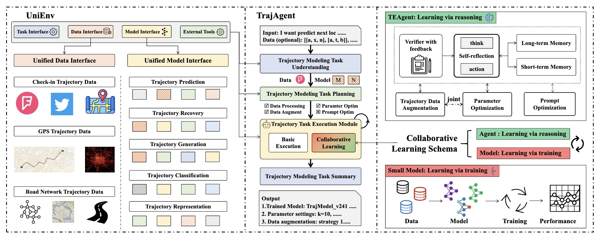
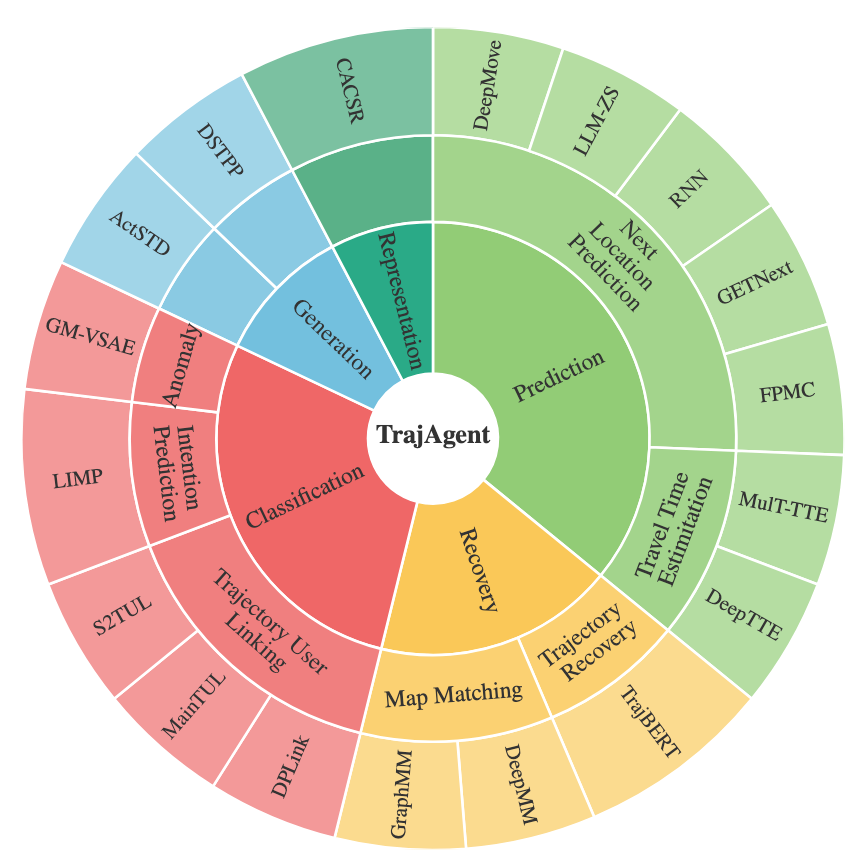

# TrajAgent: An LLM-Agent Framework for Trajectory Modeling via Large-and-Small Model Collaboration

[](https://www.python.org/)
[](LICENSE)

## 🌍 Introduction
Trajectory modeling, which includes research on trajectory data pattern mining
and future prediction, has widespread applications in areas such as life services,
urban transportation, and public administration. Numerous methods have been
proposed to address specific problems within trajectory modeling. However, the
heterogeneity of data and the diversity of trajectory tasks make effective and reliable
trajectory modeling an important yet highly challenging endeavor, even for domain
experts. In this paper, we propose TrajAgent, a agent framework powered by
large language models (LLMs), designed to facilitate robust and efficient trajectory
modeling through automation modeling. This framework leverages and optimizes
diverse specialized models to address various trajectory modeling tasks across
different datasets effectively. In TrajAgent, we first develop UniEnv, an execution
environment with a unified data and model interface, to support the execution
and training of various models. Building on UniEnv, we introduce an agentic
workflow designed for automatic trajectory modeling across various trajectory
tasks and data. Furthermore, we introduce collaborative learning schema between
LLM-based agents and small speciallized models, to enhance the performance
of the whole framework effectively.



## 🚀 Key Features

- **End-to-End Automation**: Data Preprocessing → Model Selection → Data Augmentation → Parameter Optimization → Model Training → Result Analysis
- **LLM-Driven Decision Making**: Intelligent decision mechanism based on Large Language Models for automatic optimal strategy selection
- **Multi-Task Support**: Supports various trajectory modeling tasks including trajectory prediction, user linkage, anomaly detection, and more
- **Multi-Dataset Compatibility**: Compatible with mainstream trajectory datasets such as Foursquare, Gowalla, Brightkite, etc.
- **Modular Design**: Independent and testable modules supporting both standalone and combined usage

## 📋 Supported Tasks



| Specific Task | Supported Models | Dataset Type |
|---------------|------------------|--------------|
| Next Location Prediction | DeepMove, RNN, FPMC, GETNext, LLM-ZS | checkin |
| Travel Time Estimation | DeepTTE, DutyTTE, MulTTTE | gps |
| Trajectory Recovery | TrajBERT | gps |
| Map Matching | DeepMM, GraphMM | map |
| Trajectory User Linkage | DPLink, MainTUL, S2TUL | checkin |
| Trajectory Generation | ActSTD, DSTPP | checkin |
| Trajectory Representation | CACSR | checkin |
| Trajectory Anomaly Detection | GMVSAE | gps |
| Intention Prediction | LIMP | checkin |

## 🛠️ Environment Setup

### 1. Requirements

- Python 3.7+
- CUDA 10.1+ (recommended)
- Multiple conda environments (see environment/ directory)

### 2. Environment Installation

The project includes multiple pre-configured conda environments. Install as needed:

```bash
# View available environments
ls environment/

# Install environments (examples)
conda env create -f environment/libcity_py39_torch231_cu121.txt
conda env create -f environment/STAN_py37_cu101_torch171.txt
# ... other environments
```

### 3. Environment Path Configuration

After installing environments, modify the environment paths in shell scripts:

```bash
# Modify .sh files in base_model/ directory
# Replace BASE_ENV_PATH="your_base_env_path" with actual path
# Example:
BASE_ENV_PATH="/path/to/your/conda/envs"
```

### 4. Environment Variables

```bash
export PYTHONPATH="/path/to/TrajAgent"
export OPENAI_API_KEY="your_openai_key"
export DEEPINFRA_API_KEY="your_deepinfra_key"  # optional
export SiliconFlow_API_KEY="your_siliconflow_key"  # optional
```

## 📁 Project Structure

```
TrajAgent/
├── plan_agent_run.py              # End-to-end pipeline entry
├── da_agent_run.py                # Data augmentation entry
├── fm_agent_run.py                # Data formatting/conversion entry
├── op_agent_run.py                # Result analysis/summary entry
├── param_agent_run.py             # Parameter optimization entry
├── preprocess/                    # Data preprocessing
│   ├── traj_preprocess.py
│   └── traj_preprocess_gps.py
├── data_augmentation/             # Data augmentation + utils
│   ├── da_agent.py
│   └── utils/
│       ├── base_llm.py
│       ├── llm_da_utils.py
│       ├── distribution_sampler.py
│       └── prompts.py
├── model_selection/
│   └── utils/
│       └── utils.py
├── param_optimize/
│   ├── pa_agent.py
│   └── utils/
│       └── utils.py
├── result_optimize/
│   └── optimize_agent.py
├── UniEnv/                        # Unified environment for external models
│   ├── base_model/                # Shell runners for each model
│   ├── model_lib/                 # Third-party model code
│   └── etc/
│       ├── settings.py
│       ├── da-config.yaml
│       └── model_config/
├── environment/                   # Environment specs (txt)
├── data/                          # Datasets and outputs
│   ├── input_format/
│   ├── model_output/
│   └── aux/
├── nl_input_parser.py             # Natural-language argument parser (rule + LLM fallback)
└── README_EN.md
```

## 🚀 Quick Start

### 1. Full Pipeline Execution

```bash
# Basic usage
python plan_agent_run.py \
    --task="Next_Location_Prediction" \
    --source="foursquare" \
    --target="standard" \
    --city="London" \
    --gpu_id=0

# Parameter description
# --task: Task type (see supported tasks list)
# --source: Source dataset name
# --target: Target data format (recommend using standard)
# --city: City name (required for certain datasets)
# --gpu_id: GPU device ID
```

### 1.1 Natural-Language Command Parsing

TrajAgent supports natural-language instructions with a rule-first parser and LLM fallback. The parser first extracts parameters via rules; if required fields are missing, it invokes the LLM to complete them. Set your API key if you want LLM fallback.

```bash
# Optional (enable LLM fallback):
export OPENAI_API_KEY=your_key
# Optional model control (defaults to gpt-4o-mini if not set):
export LLM_MODEL=gpt-4o-mini

# Example: run Next Location Prediction on agentmove (London), GPU 1, 10 epochs, 5 steps
python plan_agent_run.py \
  --query "I'm looking to figure out which points of interest users are likely to visit next in London"
```

Parameter semantics and supported options (also available via `nl_input_parser.explain_all_options()`):
- task: Map_Matching, Trajectory_Generation, Trajectory_Representation, Trajectory_Recovery, Next_Location_Prediction, Trajectory_User_Linkage, Travel_Time_Estimation, Trajectory_Anomaly_Detection
- source: foursquare, gowalla, brightkite, agentmove, Earthquake, tencent, chengdu
- target: foursquare, gowalla, brightkite, agentmove, standard
- city (required when source=agentmove): CapeTown, London, Moscow, Mumbai, Nairobi, NewYork, Paris, SanFrancisco, SaoPaulo, Sydney, Tokyo, Unknown
- other: gpu_id, base_model, trial_num, max_step, max_epoch, memory_length

### 2. Single Module Execution

#### Data Preprocessing
```bash
python traj_preprocess.py \
    --city="London" \
    --dataset="foursquare" \
    --model="DeepMove"
```

#### Data Augmentation + Model Training
```bash
python da_agent_run.py \
    --task="Next_Location_Prediction" \
    --dataset="foursquare" \
    --model="DeepMove" \
    --city="London" \
    --gpu_id=0 \
    --pa_da
```

#### Model Selection + Training
```bash
python fm_agent_run.py \
    --task="Next_Location_Prediction" \
    --dataset="foursquare" \
    --city="London" \
    --gpu_id=0
```

#### Result Analysis
```bash
python op_agent_run.py \
    --task="Next_Location_Prediction" \
    --dataset="foursquare" \
    --city="London"
```

## 📊 Data Preparation

### 1. Data Format

Place raw data in the `data/input_format/` directory:

```
data/input_format/
├── foursquare/
│   ├── source1.csv    # POI data
│   └── source2.csv    # Check-in data
├── gowalla/
│   └── source1.csv
└── ...
```

### 2. Supported Datasets

| Dataset | Type | Description |
|---------|------|-------------|
| foursquare | checkin | Foursquare check-in data |
| gowalla | checkin | Gowalla social network data |
| brightkite | checkin | Brightkite location data |
| agentmove | checkin | Synthetic trajectory data |
| tencent | map | Tencent map data |
| chengdu | gps | Chengdu taxi trajectory data |
| porto | gps | Porto taxi trajectory data |
| earthquake | time_series | Earthquake time series data |

### 3. Evaluation Data for NL Parsing

Evaluation datasets for the natural-language command parsing are generated by the scripts under `evaluate_userQuery/` (e.g., `gen_task_plan.py`, `eval_task_plan.py`). The generated data are stored at:

`/data/evaluate`

Notes:
- `gen_task_plan.py` produces task-plan JSON files (e.g., `task_plan_6.json`).
- Paths are absolute; ensure the target directory exists or has write permission.
- You can customize prompts/data inside `evaluate_userQuery/` before generation.

### 3. City Parameter Description

The city parameter is implemented based on AgentMove (Agentmove: A large language model based agentic framework for zero-shot next location prediction), which divides worldwide Foursquare check-in data by cities. Supported cities include:

**AgentMove City Datasets**:
- `CapeTown` - Cape Town
- `London` - London  
- `Moscow` - Moscow
- `Mumbai` - Mumbai
- `Nairobi` - Nairobi
- `NewYork` - New York
- `Paris` - Paris
- `SanFrancisco` - San Francisco
- `SaoPaulo` - São Paulo
- `Sydney` - Sydney
- `Tokyo` - Tokyo

**Usage Rules**:
- When `data_type` is `agentmove`, you can select the `city` parameter to specify the city dataset for training
- When `data_type` is other types, `city` can be set to `None` or `Unknown`

### 4. Data Download Links

#### Input Data
- **All Datasets**: [Download Link](https://pan.baidu.com/s/1ZGDzF8VsRscy8kiTVCFs_A?pwd=bp5t)
#### Model Library Code
The model library contains implementations of various trajectory modeling algorithms. You can download the complete model library from:

- **Complete Model Library**: [Download Link](https://pan.baidu.com/s/180YorYOals3xCKTVDPX0LQ?pwd=qhij)
- **LibCity**: [GitHub](https://github.com/LibCity/Bigscity-LibCity)

## ⚙️ Configuration

### 1. Data Augmentation Configuration

Modify `UniEnv/etc/da-config.yaml` to configure data augmentation parameters:

```yaml
# Position sampling method
pos_sample_method: ["uniform"]

# Item sampling method
item_sample_method: ["memorybased"]

# Time position
pos: ["time"]

# Operations requiring item sampling
need_item_sampling: ["insert", "replace", "Ti-insert", "Ti-replace"]
```

### 2. Model Configuration

Model configuration files are located in the `UniEnv/etc/model_config/` directory and can be adjusted as needed.

## 🔧 Advanced Usage

### 1. Custom Data Augmentation Strategies

```python
# Configure new augmentation strategies in da-config.yaml
augment_operation: ["Ti-crop", "Ti-insert", "Ti-mask", "Ti-reorder"]
```

### 2. Adding New Models

1. Add model code under `UniEnv/model_lib/`
2. Add execution scripts under `UniEnv/base_model/`
3. Update model configuration in `UniEnv/etc/settings.py`

### 3. Custom LLM Configuration

```python
# Modify data_augmentation/utils/base_llm.py
LLMWrapper(
    temperature=0,
    model_name="llama3-70b",
    max_tokens=6000,
    model_kwargs={"stop": "\n"},
    platform="DeepInfra"
)
```

## 📈 Performance Optimization

### 1. Memory Optimization
- Adjust `memory_length` parameter to control memory length
- Use `max_step` to control reflection rounds

### 2. Training Optimization
- Adjust `max_epoch` based on dataset characteristics
- Use appropriate `batch_size` and `learning_rate`

### 3. Parallel Processing
- Support multi-GPU training
- Data augmentation operations support parallel execution

## 🐛 FAQ

### Q1: Environment path configuration error
**A**: Ensure all `.sh` files have `BASE_ENV_PATH` replaced with the correct conda environment path.

### Q2: Dataset path issues
**A**: Check data path configuration in `UniEnv/etc/settings.py` to ensure it points to the correct data directory.

### Q3: GPU memory insufficient
**A**: Reduce `batch_size` or use smaller models, adjust `gpu_memory_utilization` parameter.

### Q4: LLM API call failures
**A**: Check API key configuration and network connection, ensure sufficient API quota.

## 🌟 Citation

If you find this work helpful, please cite our paper:

```latex
@article{du2024trajagent,
  title={TrajAgent: An LLM-Agent Framework for Trajectory Modeling via Large-and-Small Model Collaboration},
  author={Du, Yuwei and Feng, Jie and Zhao, Jie and Yuan, Jian and Li, Yong},
  journal={arXiv preprint arXiv:2410.20445},
  year={2024}
}
```

## 📞 Contact

For questions, please contact us through:
- Submit an Issue
- Send email to [hiimingwei@gmail.com]

---

**Note**: Please ensure all environment variables and paths are correctly configured before use, and adjust relevant parameters according to specific needs.
